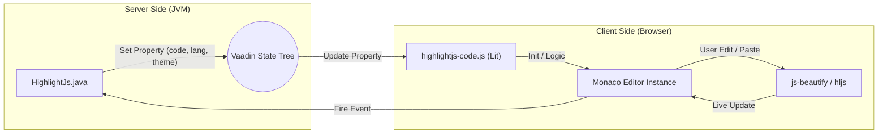

# Production-Level Guideline Documentation 🚀

This document provides a comprehensive overview of the **highlightJS-vaadin-wrapper** project. It details the architecture, code structure, and the technical logic that enables high-performance syntax highlighting and code editing in Vaadin applications.

---

## 1. Project Overview
The `highlightJS-vaadin-wrapper` is a dual-purpose integration that combines **Monaco Editor** (for premium editing) and **Highlight.js** (for detection and logic). It allows Vaadin developers to display and edit code snippets with professional aesthetics, auto-detection, and IDE-like features.

### Core Technologies
- **Java 17+**: Server-side logic.
- **Vaadin Flow**: Web framework for the Java API.
- **LitElement**: Foundation for the client-side web component.
- **Monaco Editor**: The underlying engine for code editing and rendering.
- **Highlight.js**: Used for language auto-detection and fallback highlighting logic.
- **js-beautify**: Used for high-quality code formatting on paste/blur.

---

## 2. Project Structure

```text
highlightJS-vaadin-wrapper/
├── src/main/java/              # Backend Java Logic
│   └── com/sundev/sunpaste/
│       ├── highlightJS/
│       │   └── HighlightJs.java # Primary Vaadin Component proxy
│       └── util/
│           └── Theme.java       # Enum for style management
├── src/main/resources/
│   └── META-INF/resources/frontend/
│       └── highlightjs-code.js  # Client-side Web Component (Lit + Monaco)
├── pom.xml                      # Dependency & Build configuration
└── README.md                    # Quick start guide
```

---

## 3. High-Level Architecture

The component follows the **Vaadin Component Model**, where a Java proxy (`HighlightJs.java`) communicates with a browser-based Web Component (`highlightjs-code.js`). 

Unlike traditional display-only components, this uses a **Unified Panel** approach where the viewer is the editor.



---

## 4. Detailed Component Explanations

### 4.1. Server-Side: `HighlightJs.java`
This class is the "Face" of the component for Java developers. It handles the lifecycle of the code content.

- **`@Tag("highlightjs-code")`**: Links to the custom element.
- **`@NpmPackage`**: Pulls in `monaco-editor`, `highlight.js`, and `js-beautify`.
- **Property Mapping**: Syncs state like `theme`, `showLineNumbers`, and `formatCode`.
- **Value Synchronization**: Captures `code-change` events from the client to update the Java-side `code` property, enabling two-way binding.

### 4.2. Frontend: `highlightjs-code.js`
The "brain" of the component. It initializes Monaco in the **Light DOM** (slotted into the shadow root) to ensure Monaco's global styles function correctly.

- **Unified Logic**:
    - **Initialization**: Creates a Monaco instance with custom font settings (JetBrains Mono) and theme mapping.
    - **Debounced Highlighting**: While typing, it updates internal state but suppresses full re-renders to maintain performance.
    - **Paste Interception**: When code is pasted, the component runs it through `js-beautify` and `highlight.js` (for detection) before inserting the formatted result back into Monaco.
- **Feature Set**:
    - **Header Bar**: macOS-style traffic lights, dynamic filename, and custom "ARCADE" badges.
    - **Action Buttons**: 
        - **Copy**: Simple navigator.clipboard integration.
        - **Clear**: Completely resets both the Monaco buffer and the Java property.
    - **Theme Mapping**: Intelligently maps Vaadin specific themes to `vs` or `vs-dark`.

### 4.3. Style Management: `Theme.java`
Maps Java enums to frontend theme keys. Currently supports Light and Dark modes which are mapped to Monaco's internal theme system.

---

## 5. Technical Logic Flow (Step-by-Step)

1.  **Instantiation**: Developer creates `new HighlightJs(code, "java")`.
2.  **State Sync**: Vaadin sends properties to the browser.
3.  **Monaco Mount**: `firstUpdated()` triggers, creating the Monaco instance in a slotted container.
4.  **Interaction**:
    - **Paste**: User pastes code → `onDidPaste` fires → `_beautify()` runs → Monaco updates with pretty code.
    - **Typing**: User types → `onDidChangeModelContent` fires → Debounce timer starts → `code-change` event fires back to Java.
5.  **Re-formatting**: On `blur` (focus out), if `formatCode` is true, the component performs a final cleanup of the code block.

---

## 6. Production Guidelines

### Performance
- **Monaco Workers**: Ensure the `MonacoEnvironment.getWorkerUrl` is correctly configured in your deployment to allow background syntax parsing (Web Workers).
- **Debouncing**: The component uses a 400ms debounce for server sync. This is optimized for network latency in Vaadin applications.

### Security
- **Encapsulation**: Using Monaco means we avoid raw `innerHTML` for the code body, which is a major security plus.
- **Sanitization**: `js-beautify` is safe to run on untrusted strings, but the server should still validate input size to avoid memory exhaustion attacks.

### Customization
- **Fonts**: The component looks for 'JetBrains Mono' and 'Fira Code' by default. Bundle these in your app for the best look!

---

> [!IMPORTANT]
> Because Monaco injects global CSS, it is mounted as a **slotted element**. Do not try to move the editor container inside the `shadowRoot` manually, as it will break Monaco's context menus and tooltips.
