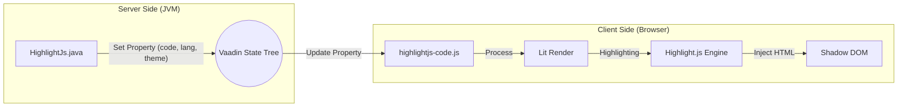

# Production-Level Guideline Documentation 🚀

This document provides a comprehensive overview of the **highlightJS-vaadin-wrapper** project. It details the architecture, code structure, and the technical logic that enables high-performance syntax highlighting in Vaadin applications.

---

## 1. Project Overview
The `highlightJS-vaadin-wrapper` is a server-side Java integration for the popular [Highlight.js](https://highlightjs.org/) library. It allows Vaadin developers to display code snippets with premium aesthetics, auto-detection, and interactive features like copy-to-clipboard.

### Core Technologies
- **Java 17+**: Server-side logic.
- **Vaadin Flow**: Web framework for the Java API.
- **LitElement**: Foundation for the client-side web component.
- **Highlight.js**: The underlying engine for syntax highlighting.
- **js-beautify**: Used for optional code formatting.

---

## 2. Project Structure

```text
highlightJS-vaadin-wrapper/
├── src/main/java/              # Backend Java Logic
│   └── com/sundev/sunpaste/
│       ├── highlightJS/
│       │   └── HighlightJs.java # Primary Vaadin Component
│       └── util/
│           └── Theme.java       # Enum for style management
├── src/main/resources/
│   └── META-INF/resources/frontend/
│       └── highlightjs-code.js  # Client-side Web Component (Lit)
├── pom.xml                      # Dependency & Build configuration
└── README.md                    # Quick start guide
```

---

## 3. High-Level Architecture

The component follows the **Vaadin Component Model**, where a Java proxy (`HighlightJs.java`) communicates with a browser-based Web Component (`highlightjs-code.js`) via shared properties.



---

## 4. Detailed Component Explanations

### 4.1. Server-Side: `HighlightJs.java`
This class is the "Face" of the component for Java developers. It extends `Component` and implements standard Vaadin mixins.

- **`@Tag("highlightjs-code")`**: Defines the custom HTML tag used in the browser.
- **`@NpmPackage`/`@JsModule`**: Tells Vaadin to download the required NPM libraries and include the local JS file in the frontend bundle.
- **Property Mapping**: Uses `getElement().setProperty("name", value)` to sync state to the frontend. This is more efficient than calling JS functions directly as it batches changes with the Vaadin update cycle.

### 4.2. Frontend: `highlightjs-code.js`
A standard **LitElement** component that handles the heavy lifting of rendering and styling.

- **Shadow DOM**: Uses a Shadow Root to encapsulate styles, ensuring that Highlight.js themes don't leak into the rest of the application.
- **Dynamic Theme Injection**: The `_loadTheme()` method dynamically injects `<link>` tags into the shadow root from CDN, allowing theme switching without reloading the page.
- **Highlighting Logic**: The `_highlight()` method detects if the user wants auto-formatting (`js-beautify`) or specific language highlighting (`hljs.highlight`).
- **Feature Rich**: Includes built-in support for:
    - macOS-style decorative buttons.
    - Filename display.
    - Copy-to-clipboard with visual feedback.
    - Optional line numbers.

### 4.3. Style Management: `Theme.java`
A typed enumeration that maps human-readable names to the specific CSS filenames used by Highlight.js.
- **Benefit**: Provides compile-time safety. Instead of passing strings like `"base16/solarized-dark"`, developers use `Theme.SOLARIZED_DARK`.

---

## 5. Technical Logic Flow (Step-by-Step)

1.  **Instantiation**: Developer creates `new HighlightJs(code, "java")`.
2.  **State Sync**: Vaadin's engine serializes the "code" and "language" properties and sends them to the browser.
3.  **Property Change**: The LitElement in the browser detects the property changes and triggers an update.
4.  **Processing**:
    - If `formatCode` is true, `js-beautify` cleans the string.
    - `Highlight.js` parses the string and generates a string of HTML with `<span class="hljs-...">` tags.
5.  **Rendering**: Lit renders the header (copy button, dots) and the code block, injecting the generated HTML into the `<code>` tag safely.

---

## 6. Production Guidelines

### Performance
- **Lazy Loading**: The Highlight.js library is loaded as an NPM dependency. Leverage Vaadin's production build (Vite/Webpack) to ensure the bundle is minified and tree-shaken.
- **Code Pre-processing**: For extremely large files (50,000+ lines), consider disabling `formatCode` to avoid UI thread blocking during the beautification process.

### SEO & Accessibility
- **Semantic HTML**: The component uses `<pre>` and `<code>` tags, which are standard for accessibility tools and SEO indexers.
- **Theme Contrast**: When using `GITHUB_DARK` or `DRACULA`, ensure the surrounding application background doesn't create "vibrating" color issues for low-vision users.

### Security
- **XSS Prevention**: The component uses `.innerHTML` to render the highlighted code. This is **safe** because Highlight.js's output consists of its own span tags and it escapes original characters. However, always ensure the source code passed from the server is trusted.

---

> [!TIP]
> To add a new theme not in the enum, use `highlight.setTheme("your-theme-name")`. As long as it exists in the [Highlight.js style gallery](https://highlightjs.org/static/demo/), it will work!
